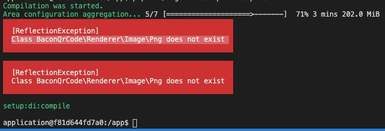

## Setup Magento 2
Clone magento 2 in docker folder
```
git clone https://github.com/magento/magento2.git
cd magento2
git checkout 2.3
```

## Setup local domain
```
sudo -- sh -c "echo '127.0.0.1 magento2.docker' >> /etc/hosts"
```

## Run
```
docker-compose up -d --build
```

App: http://magento2.docker

PHPMyAdmin: http://127.0.0.1:8080

## Access docker container
```
docker exec -it web bash
```

Go to magento folder inside docker container

```
cd app
```

Then run composer install in the root directory of Magento
```
composer install
```

## Install Magento2

Install
```
php bin/magento setup:install \
--admin-firstname=Admin \
--admin-lastname=istrator \
--admin-email=admin@admin.com \
--admin-user=admin \
--admin-password='abcd1234' \
--base-url=http://magento2.docker \
--base-url-secure=https://magento2.docker \
--backend-frontname=admin \
--db-host=mysql \
--db-name=magento \
--db-user=root \
--db-password=root \
--use-rewrites=1 \
--language=en_US \
--currency=IDR \
--timezone=Asia/Jakarta \
--use-secure-admin=1 \
--admin-use-security-key=1 \
--session-save=files \
--use-sample-data
```

## Setup & compile

```
1. php bin/magento setup:upgrade
2. php bin/magento setup:di:compile
3. php bin/magento cache:flush
```

## Install Bacon QR Code in Magento (Optional)

If you encounter this kind of error when running `php bin/magento setup:di:compile` after Magento has been installed



Please add `bacon/bacon-qr-code` as a dependencies in magento root folder with command

```
composer require bacon/bacon-qr-code
```

Then try to run `php bin/magento setup:di:compile` again

## Installation Troubleshoot

If you encounter this problem when trying to install Magento inside docker
```
Fatal error: Uncaught Error: Call to undefined function xdebug_disable()
```

Go to this directory (after finished installing dependencies)
```
vendor/magento/magento2-functional-testing-framework/src/Magento/FunctionalTestingFramework/_bootstrap.php
```

replace this line
```
xdebug_disable();
```

into
```
if (function_exists('xdebug_disable')) {
        xdebug_disable();
}
```

## TODO
- [x] Create docker for magento
- [ ] Create our own image
- [x] Integrate with our plugin
- [ ] Support other version
- [ ] Seeding product
- [ ] Add Xendit API Key
- [ ] Integrate with E2E testing
